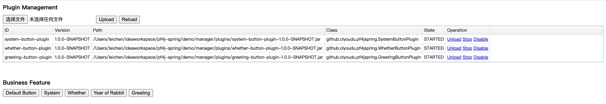

# pf4j-spring
Spring-boot combines [PF4J](https://github.com/pf4j) to implement plug-in definition, development, packaging, upload, load, unload, start, stop, enable, disable, use and other functions

## Modules
- [pf4j-spring-core](pf4j-spring-core): A copy of [pf4j-spring](https://github.com/pf4j/pf4j-spring), some implementation changed.
- [pf4j-manager-spring-boot-starter](pf4j-manager-spring-boot-starter): Spring boot stater
- [demo](demo): A spring boot application with 3 plugins
  - [manager](demo/manager): Main application(spring boot)
  - [sdk](demo/sdk): Extension point definition for main application
  - [plugins](demo/plugins): 3 plugins(4 extensions) implements extension point

## Build & Run
```shell
git clone https://github.com/clyoudu/pf4j-spring.git
```
Then edit pf4j-spring/demo/manager/src/main/resources/application.yml, change `spring.pf4j.path` to another dir
```shell
cd pf4j-spring
mvn clean package
cd demo/manager/target
java -jar manager-1.0.0-SNAPSHOT.jar
```
Open `http://localhost:8080`, you will see page like this


Plugin Management:
1. You can upload plugins jar in demo/plugins/\*/target/\*.jar
2. Click 'Reload' button, then the plugin list will refresh automatically
3. Load/Unload/Start/Stop/Enable/Disable/Delete operations are available for different plugin state

Business Feature:
1. With plugin state changed, extension buttons list changed
2. Click buttons, a message displayed as plugin extension expected

## TODO
[] Managing & Using plugin through spring application context is not tested

## Plugin Framework for Java
[PF4J](https://github.com/pf4j)